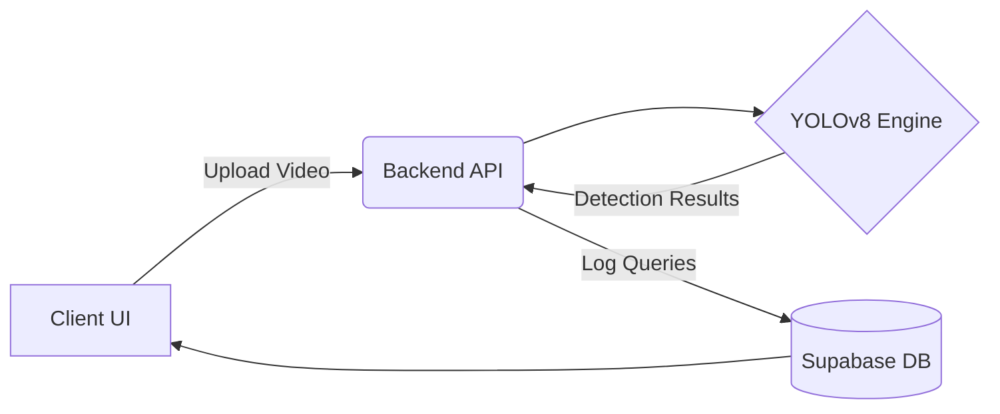

# 👁️ VisionQuery AI Launch Implementation

An AI-powered video and image analysis SaaS platform using local YOLOv8 tracking and Supabase.

## 🏗 Architecture
The application is structured into decoupled frontend and backend services, orchestrated to provide real-time AI computer vision capabilities.
- **Frontend (React)**: Handles user dashboards, video uploads, and analytics visualization.
- **Backend (Python/FastAPI)**: Integrates with the YOLOv8 object detection engine for processing frames.
- **Database (Supabase)**: Scalable PostgreSQL backend for storing user data, query logs, and detection metadata (`database_schema.sql`).



## 🚀 Setup Instructions
### 1. Database Setup
Execute `database_schema.sql` in your Supabase SQL editor to create the necessary tables.

### 2. Backend & AI Engine
```bash
cd backend
pip install -r requirements.txt
# Run the FastAPI server
uvicorn main:app --reload
```

### 3. Frontend
```bash
cd frontend
npm install
npm start
```
